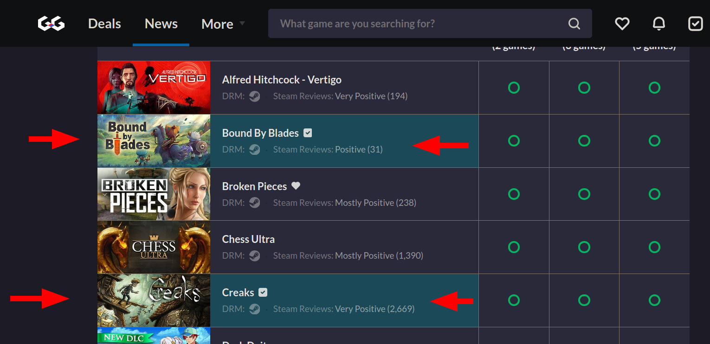

# My personal userscript collection

User scripts can improve your browsing experience, and open a lot of possibilities to make the sites you visit better by adding features, making them easier to use, or taking out the annoying bits.

## How to install a userscript manager

https://github.com/bvolpato/awesome-userscripts#how-to-use
Personally, I use violentmonkey on firefox. You will need a userscript manager before using any of these userscripts.

To install any of my scripts, click the name of the userscript below after installing a userscript manager.

## New York Times crossword helper [(install)](https://github.com/kleutzinger/userscripts/raw/main/userscripts/nyt-crossword-helper.user.js)

  

1. Add the word length inside the clue section. This helps you avoid counting cells manually.
2. More to come soon

[play the crossword here](https://www.nytimes.com/crosswords)

## Auto redeem steam key [(install)](https://github.com/kleutzinger/userscripts/raw/main/userscripts/auto-redeem-steam-key.user.js)

  

When you click a link like https://store.steampowered.com/account/registerkey?key=XXXX-XXXXXX-XXXXX, This userscript autoclicks the checkbox and the Continue button so your games get instantly added to your steam account. Good for game bundles

## [gg.deals](https://gg.deals) Highlight Owned Games [(install)](https://github.com/kleutzinger/userscripts/raw/main/userscripts/gg-deals-highlight-owned-games.user.js)

  

In lists of games on https://gg.deals, this highlights games you already have in your collection. To use, make an account and import your collection here https://gg.deals/collection

## Github Issues Auto Assign Self [(install)](https://github.com/kleutzinger/userscripts/raw/main/userscripts/github-issues-auto-assign-self.user.js)

Auto assign self when creating new issues on Github where possible.
